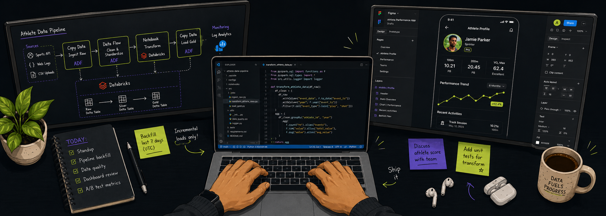
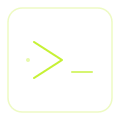
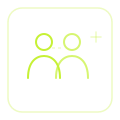

<table>
<tr>
<td width="33%" valign="top">

## small things

**Typestrike**

A terminal typing test because leaving the terminal felt unnecessary. Interactive rendering, zero dependencies, distributed as a single executable via Node.js SEA.

`Node.js · zero dependencies · SEA`

[`source`](https://github.com/om762/Typestrike)&ensp;·&ensp;[`released`](https://github.com/om762/Typestrike/releases)

  

**TeamFinder**

Find people to build with.

`Next.js · TypeScript · TailwindCSS · DynamoDB · S3`

[`live →`](https://team-finder-xi.vercel.app/)&ensp;·&ensp;[`source`](https://github.com/om762/teamFinder)

 

</td>
</tr>
</table>

---

## elsewhere

[`Leetcode`](https://leetcode.com/om762)&ensp;·&ensp;[`LinkedIn`](https://www.linkedin.com/in/om762/)&ensp;·&ensp;[`Website`](https://om762.pythonanywhere.com)&ensp;·&ensp;[`X`](https://x.com/OmPrakash_762)&ensp;·&ensp;[`Substack`](https://substack.com/@om762)

 
