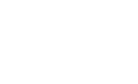



<table>
<tr>
<td width="24%" valign="top">

currently thinking about →

 

</td>
<td width="76%" valign="top">

## things I build

*I tend to build things when something starts annoying me.*

 

### BlockFit

> *Notion couldn't handle the thing I wanted to paste into it.*

Long, richly formatted LLM responses can hit Notion's paste payload limit. Splitting them manually destroys formatting — browser text selection and an LLM's native Copy button use different clipboard pipelines.

**React · TypeScript · DOMPurify · react-window**

[`live →`](https://blockfit-om762.vercel.app)&ensp;·&ensp;[`source`](https://github.com/om762/BlockFit)

 

---

### Roadmap

> *Learning something new shouldn't mean losing track of where you are.*

Started as a personal learning tool. Evolved into a full platform for creating, sharing, following roadmaps, and tracking progress.

> The difficult part wasn't creating a roadmap.
> It was changing one without breaking somebody else's progress.

**Django · React · MySQL · custom CSS**

[`live →`](https://om762.pythonanywhere.com)&ensp;·&ensp;[`source`](https://github.com/om762/Roadmap)&ensp;·&ensp;`still maintaining`

 

---

### Vibely

> *Your likes are data. Why are they still a mess?*

Likes and saves across Spotify, YouTube, Pinterest — they all become one giant unsorted pile. Vibely explores using AI to organize saved content into playlists, boards, and collections that actually make sense.

**React Native · Python · PostgreSQL · AWS · Redis · Docker · AI/LLMs**

[`source`](https://github.com/om762/Vibely)&ensp;·&ensp;`currently cooking` 🍳

 

</td>
</tr>
</table>

---

<table>
<tr>
<td width="33%" valign="top">

## small things

**Typestrike**

A terminal typing test because leaving the terminal felt unnecessary. Interactive rendering, zero dependencies, distributed as a single executable via Node.js SEA.

`Node.js · zero dependencies · SEA`

[`source`](https://github.com/om762/Typestrike)&ensp;·&ensp;`released`

  

**TeamFinder**

Find people to build with.

`Next.js · TypeScript · TailwindCSS · DynamoDB · S3`

[`live →`](https://team-finder-xi.vercel.app/)&ensp;·&ensp;[`source`](https://github.com/om762/teamFinder)

 

</td>
<td width="34%" valign="top">

## why I build

**01** solve the annoying thing, not the theoretical thing
**02** hide complexity until it's needed
**03** make the final thing better than the first idea

 

## rabbit holes

Things I keep going deeper into for no good reason:

`AI agents`&ensp;`data systems`&ensp;`system design`
`minimal interfaces`&ensp;`micro-optimizations`&ensp;`niche products`

 

> **rabbit hole #04**
> how much abstraction is actually useful before it starts hiding the system?
>
> currently investigating →

</td>
<td width="33%" valign="top">

## by day

`sources` → `ingestion` → `processing` → `lakehouse` → `serving`

Databricks · Azure · Azure Data Factory
PySpark · Spark · Spark SQL · Python · SQL

data migration & data engineering in a Data + AI environment.

 

## what's on the desk

`Python`&ensp;`SQL`&ensp;`PySpark`&ensp;`Databricks`
`Spark`&ensp;`Django`&ensp;`React`&ensp;`Azure`
`AWS`&ensp;`TypeScript`&ensp;`Docker`&ensp;`PostgreSQL`

no proficiency bars. the projects speak.

</td>
</tr>
</table>

---

<table>
<tr>
<td width="50%" valign="top">

**→ things I'm figuring out**

→ DevOps — pipelines, repos, test plans
→ Databricks Asset Bundles
→ Agentic AI — how agents actually work, not just the API calls

</td>
<td width="50%" valign="top">

**→ what I want to learn next**

→ AI function calling
→ AWS SageMaker
→ MLOps

</td>
</tr>
</table>

---

## elsewhere

[`GitHub`](https://github.com/om762)&ensp;·&ensp;[`LinkedIn`](https://www.linkedin.com/in/om762/)&ensp;·&ensp;[`Website`](https://om762.pythonanywhere.com)&ensp;·&ensp;[`X`](https://x.com/OmPrakash_762)

 

