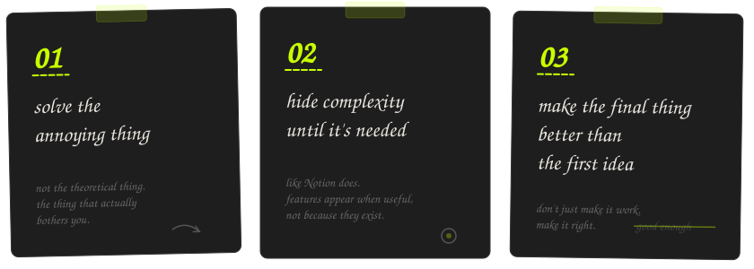
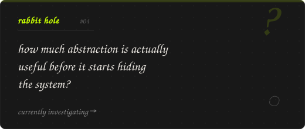
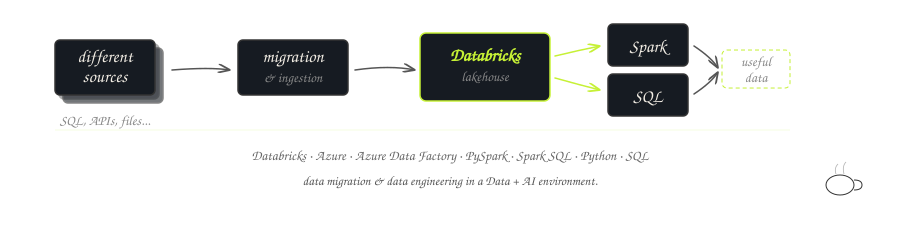



 

currently thinking about →

<table>
<tr>
<td>

**currently**&ensp;&ensp;&ensp;&ensp;&ensp;&ensp;&ensp;&ensp;&ensp;&ensp;&ensp;&ensp;&ensp;&ensp;&ensp;&ensp;&ensp;&ensp;&ensp;&ensp;&ensp;&ensp;&ensp;&ensp;&ensp;&ensp;&ensp;&ensp;&ensp;&ensp;&ensp;&ensp;&ensp;&ensp;&ensp;&ensp;&ensp;&ensp;

→ building Vibely  
→ getting deeper into Databricks  
→ learning Agentic AI  
→ exploring DevOps workflows

last scribbled · 23.08.26

</td>
</tr>
</table>

---

## things I build

*I tend to build things when something starts annoying me.*

 

### BlockFit

> *Notion couldn't handle the thing I wanted to paste into it.*

Long, richly formatted LLM responses can hit Notion's paste payload limit. Splitting them manually destroys formatting — browser text selection and an LLM's native Copy button use different clipboard pipelines.

**React · TypeScript · DOMPurify · react-window**

&nbsp;how it works →

 

The interesting part wasn't the UI.

It was understanding what actually happens inside the clipboard:

`
HTML clipboard data
      ↓
plain text clipboard data
      ↓
browser clipboard APIs
      ↓
OS clipboard behavior
      ↓
format preservation
      ↓
safe chunking
      ↓
virtualized rendering
`

The splitter has to divide long formatted content without destroying the structure. You can't just split HTML at arbitrary byte boundaries — you need to understand the DOM tree, preserve nesting, and handle edge cases in block vs. inline elements.

I ended up learning more about clipboard formats than I expected.

 

[`live →`](https://blockfit-om762.vercel.app)&ensp;·&ensp;[`source`](https://github.com/om762/BlockFit)

---

### Roadmap

> *Learning something new shouldn't mean losing track of where you are.*

Started as a personal learning tool. Evolved into a full platform for creating, sharing, following roadmaps, and tracking progress.

> The difficult part wasn't creating a roadmap.  
> It was changing one without breaking somebody else's progress.

**Django · React · MySQL · custom CSS**

&nbsp;what made it interesting →

 

The versioning problem sits at the intersection of:

- complex relational data modeling
- state consistency across users
- progress tracking against a moving target
- keeping old references valid while supporting new structure

This isn't a CRUD app with a roadmap skin. The data model handles version branches, user-progress snapshots, and structural changes without creating orphaned or inconsistent states.

 

[`live →`](https://om762.pythonanywhere.com)&ensp;·&ensp;[`source`](https://github.com/om762/Roadmap)&ensp;·&ensp;`still maintaining`

---

### Vibely

> *Your likes are data. Why are they still a mess?*

Likes and saves across Spotify, YouTube, Pinterest — they all become one giant unsorted pile. Vibely explores using AI to organize saved content into playlists, boards, and collections that actually make sense.

**React Native · Python · PostgreSQL · AWS · Redis · Docker · AI/LLMs**

[`source`](https://github.com/om762/Vibely)&ensp;·&ensp;`currently cooking`

---

## small things

**Typestrike**&ensp;—&ensp;A terminal typing test because leaving the terminal felt unnecessary. Interactive rendering, zero dependencies, distributed as a single executable via Node.js SEA.  
`Node.js · zero dependencies · SEA`&ensp;·&ensp;[`source`](https://github.com/om762/Typestrike)&ensp;·&ensp;`released`

 

**TeamFinder**&ensp;—&ensp;Find people to build with.  
`Next.js · TypeScript · TailwindCSS · DynamoDB · S3`&ensp;·&ensp;[`live →`](https://team-finder-xi.vercel.app/)&ensp;·&ensp;[`source`](https://github.com/om762/teamFinder)

---

## why I build

---

## rabbit holes

Things I keep going deeper into for no good reason:

`AI agents`&ensp;·&ensp;`data systems`&ensp;·&ensp;`system design`&ensp;·&ensp;`minimal interfaces`&ensp;·&ensp;`micro-optimizations`&ensp;·&ensp;`niche products`

 

---

## by day

---

## what's on the desk

`Python`&ensp;`SQL`&ensp;`JavaScript`&ensp;`Django`&ensp;`React`&ensp;`PySpark`&ensp;`Spark`&ensp;`Databricks`&ensp;`Azure`&ensp;`AWS`&ensp;`Docker`&ensp;`PostgreSQL`&ensp;`TypeScript`&ensp;`Node.js`&ensp;`React Native`

no proficiency bars. the projects speak.

---

&ensp;things I'm figuring out

 

→ DevOps — pipelines, repos, test plans  
→ Databricks Asset Bundles  
→ Agentic AI — how agents actually work, not just the API calls

&ensp;what I want to learn next

 

→ AI function calling  
→ AWS SageMaker  
→ MLOps

---

## elsewhere

[`GitHub`](https://github.com/om762)&ensp;·&ensp;[`LinkedIn`](https://www.linkedin.com/in/om762/)&ensp;·&ensp;[`Website`](https://om762.pythonanywhere.com)&ensp;·&ensp;[`X`](https://x.com/OmPrakash_762)

---

